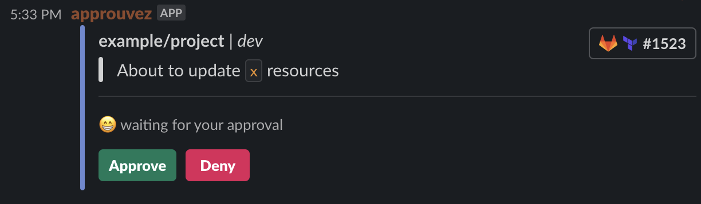
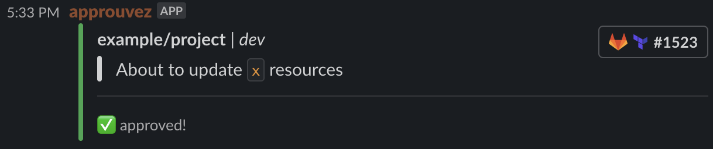
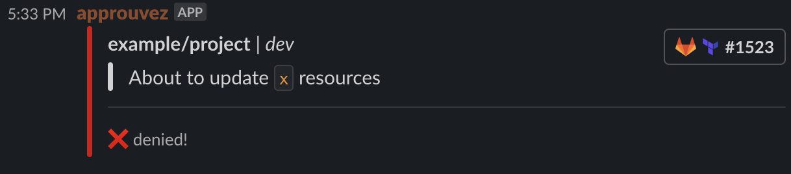

# ✅ approuvez

[](https://godoc.org/github.com/mvisonneau/approuvez)
[](https://goreportcard.com/report/github.com/mvisonneau/approuvez)
[](https://hub.docker.com/r/mvisonneau/approuvez/)
[](https://github.com/mvisonneau/approuvez/actions)
[](https://coveralls.io/github/mvisonneau/approuvez?branch=main)

This is a command line helper which aims to send a message to someone over Slack and block until a decision has been made. Depending on the decision, an exit code of 0 or 1 will be returned.

- **approve** : `exit 0`
- **deny** : `exit 1`

My motivation for such tool was to be able to get a live confirmation from someone when some sensitive actions being done as part of an automated process are about to be made (ie: CI/CD)
Its current implementation makes it agnostic of any kind of CI/CD platforms. However, for now it only **supports Slack** as the notification endpoint.

## Quickstart

Here is some documentation around [how to get started](/examples/quickstart.md) and tinker with it.

[](https://asciinema.org/a/386263)

Associated / example messages:

### Request

```bash
~$ approuvez ask \
   --message "<your_message" \
   --user "<user_id or user_email>" \
   # Optionally you can add a link
   --link-name "<whatever_suits_you>" \
   --link-url "<url>"
INFO[2021-01-22T17:16:30Z] session initiated successfully                session_id=a307db07-9993-4467-b11b-c9d7187dc542
INFO[2021-01-22T17:16:30Z] message sent, waiting for user's decision
```



### Approved

```bash
~$ approuvez ask <args>
[..]
INFO[2021-01-22T17:16:30Z] message sent, waiting for user's decisio
INFO[2021-01-22T17:16:41Z] received response                             decision=APPROVE user_id=ULP000000 user_name=foo
~$ echo $?
0
```



### Denied

```bash
~$ approuvez ask <args>
[..]
INFO[2021-01-22T17:16:30Z] message sent, waiting for user's decisio
INFO[2021-01-22T17:16:41Z] received response                             decision=DENY user_id=ULP000000 user_name=foo
~$ echo $?
1
```



## Usage

```bash
~$ approuvez --help
NAME:
   approuvez - Command line helper to obtain live confirmation from people in a blocking fashion

USAGE:
   approuvez [global options] command [command options] [arguments...]

COMMANDS:
   ask      send a message to someone and wait for a response
   serve    run the server thing
   help, h  Shows a list of commands or help for one command

GLOBAL OPTIONS:
   --log-level level    log level (debug,info,warn,fatal,panic) (default: "info") [$APPROUVEZ_LOG_LEVEL]
   --log-format format  log format (json,text) (default: "text") [$APPROUVEZ_LOG_FORMAT]
   --tls-disable        disable mutual tls for gRPC transmissions (use with care!) (default: false) [$APPROUVEZ_TLS_DISABLE]
   --tls-ca-cert path   TLS CA certificate path [$APPROUVEZ_TLS_CA_CERT]
   --tls-cert path      TLS certificate path [$APPROUVEZ_TLS_CERT]
   --tls-key path       TLS key path [$APPROUVEZ_TLS_KEY]
   --help, -h           show help (default: false)
```

### Server

```bash
~$ approuvez serve --help
NAME:
   approuvez serve - run the server thing

USAGE:
   approuvez serve [command options] [arguments...]

OPTIONS:
   --slack-token token     token to use in order to authenticate requests against slack [$APPROUVEZ_SLACK_TOKEN]
   --listen-address token  token to use in order to authenticate requests against slack (default: ":8443") [$APPROUVEZ_LISTEN_ADDRESS]
   --help, -h              show help (default: false)
```

### Client

```bash
~$ approuvez ask --help
NAME:
   approuvez ask - send a message to someone and wait for a response

USAGE:
   approuvez ask [command options] [arguments...]

OPTIONS:
   --endpoint endpoint, -e endpoint                server endpoint to connect upon (default: "127.0.0.1:8443") [$APPROUVEZ_SERVER_ENDPOINT]
   --user email or slack ID, -u email or slack ID  email or slack ID of a person that should review the message [$APPROUVEZ_USER]
   --message message, -m message                   message to display on Slack [$APPROUVEZ_MESSAGE]
   --link-name name                                name of a link button to append to the message [$APPROUVEZ_LINK_NAME]
   --link-url url                                  url of a link button to append to the message [$APPROUVEZ_LINK_URL]
   --help, -h                                      show help (default: false)
```

## Architecture


## Install

### Go

```bash
~$ go install github.com/mvisonneau/approuvez/cmd/approuvez@latest
```

### Homebrew

```bash
~$ brew install mvisonneau/tap/approuvez
```

### Docker

```bash
~$ docker run -it --rm docker.io/mvisonneau/approuvez
~$ docker run -it --rm ghcr.io/mvisonneau/approuvez
~$ docker run -it --rm quay.io/mvisonneau/approuvez
```

### Scoop

```bash
~$ scoop bucket add https://github.com/mvisonneau/scoops
~$ scoop install approuvez
```

### Binaries, DEB and RPM packages

Have a look onto the [latest release page](https://github.com/mvisonneau/approuvez/releases/latest) to pick your flavor and version. Here is an helper to fetch the most recent one:

```bash
~$ export APPROUVEZ_VERSION=$(curl -s "https://api.github.com/repos/mvisonneau/approuvez/releases/latest" | grep '"tag_name":' | sed -E 's/.*"([^"]+)".*/\1/')
```

```bash
# Binary (eg: linux/amd64)
~$ wget https://github.com/mvisonneau/approuvez/releases/download/${APPROUVEZ_VERSION}/approuvez_${APPROUVEZ_VERSION}_linux_amd64.tar.gz
~$ tar zxvf approuvez_${APPROUVEZ_VERSION}_linux_amd64.tar.gz -C /usr/local/bin

# DEB package (eg: linux/386)
~$ wget https://github.com/mvisonneau/approuvez/releases/download/${APPROUVEZ_VERSION}/approuvez_${APPROUVEZ_VERSION}_linux_386.deb
~$ dpkg -i approuvez_${APPROUVEZ_VERSION}_linux_386.deb

# RPM package (eg: linux/arm64)
~$ wget https://github.com/mvisonneau/approuvez/releases/download/${APPROUVEZ_VERSION}/approuvez_${APPROUVEZ_VERSION}_linux_arm64.rpm
~$ rpm -ivh approuvez_${APPROUVEZ_VERSION}_linux_arm64.rpm
```

### HELM

If you want to make the server run on [kubernetes](https://kubernetes.io/), there is a [helm chart](https://github.com/mvisonneau/helm-charts/tree/main/charts/approuvez) available for this purpose.

You can check the chart's [values.yml](https://github.com/mvisonneau/helm-charts/blob/main/charts/approuvez/values.yaml) for complete configuration options.

```bash
# Add the helm repository to your local client
~$ helm repo add mvisonneau https://charts.visonneau.fr

# Minimal configuration to get it to run successfully
~$ cat <<EOF > values.yml
envVariables:
  # You can refer to examples/quickstart.md whichwill guide you through how to obtain this value
  - name: APPROUVEZ_SLACK_TOKEN
    value: "<your-slack-app-oauth-token>" 
  # For testing purposes you can use this value, otherwise, you should be setting
  # APPROUVEZ_TLS_CA_CERT, APPROUVEZ_TLS_CERT, APPROUVEZ_TLS_KEY accordingly
  - name: APPROUVEZ_TLS_DISABLE
    value: "true"

# You will also probably want to expose the service publically or configure
# an ingress for this purpose
EOF

# Release the chart on your Kubernetes cluster
~$ helm upgrade -i approuvez mvisonneau/approuvez -f values.yml
```

## Security

You can [leverage mTLS](/examples/mutual_tls.md) to secure the gRPC connections between the client and the server. The interaction endpoint between slack and the server still needs some more love though!

## Develop / Test

```bash
~$ make build
~$ ./approuvez
```

## Build / Release

If you want to build and/or release your own version of `approuvez`, you need the following prerequisites :

- [git](https://git-scm.com/)
- [golang](https://golang.org/)
- [make](https://www.gnu.org/software/make/)
- [goreleaser](https://goreleaser.com/)

```bash
~$ git clone git@github.com:mvisonneau/approuvez.git && cd approuvez

# Build the binaries locally
~$ make build-local

# Build the binaries and release them (you will need a GITHUB_TOKEN and to reconfigure .goreleaser.yml)
~$ make release
```

## Contribute

Contributions are more than welcome! Feel free to submit a [PR](https://github.com/mvisonneau/approuvez/pulls).

## Terminology

`approuvez` is a conjugation of the verb [approuver](https://www.larousse.fr/conjugaison/francais/approuver/518) in French 🇫🇷, equivalent to `approve` in English 🇬🇧
