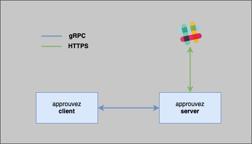

# ✅ approuvez

[](https://godoc.org/github.com/mvisonneau/approuvez)
[](https://goreportcard.com/report/github.com/mvisonneau/approuvez)
[](https://hub.docker.com/r/mvisonneau/approuvez/)
[](https://github.com/mvisonneau/approuvez/actions)
[](https://coveralls.io/github/mvisonneau/approuvez?branch=master)

> Obtain live confirmation from people

## Usage

```bash
NAME:
   approuvez - Command line helper to obtain live confirmation from people in a blocking fashion

USAGE:
   approuvez [global options] command [command options] [arguments...]

COMMANDS:
   ask      send a message to someone and wait for a response
   serve    run the server thing
   help, h  Shows a list of commands or help for one command

GLOBAL OPTIONS:
   --log-level level    log level (debug,info,warn,fatal,panic) (default: "info") [$APPROUVEZ_LOG_LEVEL]
   --log-format format  log format (json,text) (default: "text") [$APPROUVEZ_LOG_FORMAT]
   --help, -h           show help (default: false)
```

## Architecture



## Develop / Test

```bash
~$ make build
~$ ./approuvez
```

## Build / Release

If you want to build and/or release your own version of `approuvez`, you need the following prerequisites :

- [git](https://git-scm.com/)
- [golang](https://golang.org/)
- [make](https://www.gnu.org/software/make/)
- [goreleaser](https://goreleaser.com/)

```bash
~$ git clone git@github.com:mvisonneau/approuvez.git && cd approuvez

# Build the binaries locally
~$ make build-local

# Build the binaries and release them (you will need a GITHUB_TOKEN and to reconfigure .goreleaser.yml)
~$ make release
```

## Contribute

Contributions are more than welcome! Feel free to submit a [PR](https://github.com/mvisonneau/approuvez/pulls).

## Terminology

`approuvez` is a conjugation of the verb [approuver](https://www.larousse.fr/conjugaison/francais/approuver/518) in French 🇫🇷, equivalent to `approve` in English 🇬🇧
